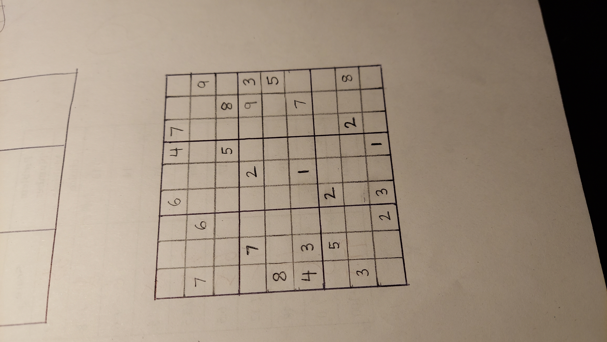

# Sudoku-Solver-CV
 
CNN code is from this [website](https://towardsdatascience.com/mnist-handwritten-digits-classification-using-a-convolutional-neural-network-cnn-af5fafbc35e9#_=_)


## Execution
```
$ python MainRunner.py image.jpg
```

## Results


